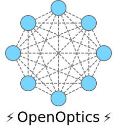
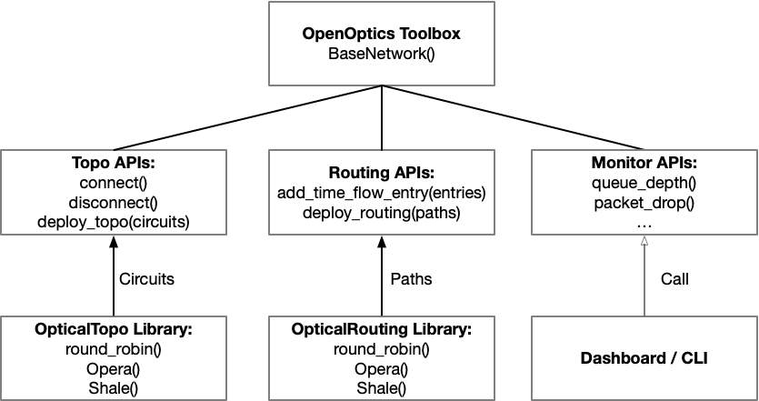

<div align="center">

<h3>
Easy design, testing, and deployment of optical datacenter networks for everyone
</h3>

<p>
| <a href="https://openoptics.mpi-inf.mpg.de/"><b>Documentation</b></a> | <a href="https://arxiv.org/abs/2411.18319"><b>Paper</b></a> |
</p>

</div>


---

*Latest News* 🔥

- [2025/09] We will host [OpenOptics Tutorial](https://conferences.sigcomm.org/sigcomm/2025/tutorials-hackathons/tutorial-odcn/) at SIGCOMM'25 on September 8th! See you at Coimbra!

---

# What is OpenOptics?

OpenOptics is a general framework for realizing different optical data center network architectures in a plug-and-play manner.
With OpenOptics, users can deploy customized optical data center networks on the testbed, emulation, or simulation with ~10 lines of python code.
Under the hood, user configurations are converted to control plane programs and deployed to the underlining OCSes and P4 switches.

We have now published the Mininet backend, where users can realize optical DCNs in a full software emulation using BMv2 software switches and Mininet networks.
The Tofino-based backend will be released soon.

# Quick Start

## Connect to Your Remote Machine
If you're using a remote machine, set up port forwarding for viewing the OpenOptics dashboard.
```
ssh -L8001:0.0.0.0:8001 YOUR_MACHINE
```

## Get Pre-Build Docker Images and Project Code
Install [docker](https://docs.docker.com/engine/install/) if you haven't already.
Then clone the project repo and pull the pre-build development Docker image.
```
git clone https://github.com/mpi-ncs/openoptics.git
docker pull ymlei/openoptics:latest
```

## Enter OpenOptics Environment with VS Code

Open folder `openoptics` with VSCode remote extension.
With Docker and the VS Code Dev Containers extension installed, simply press Ctrl+Shift+P or Command+Shift+P (Mac) in your VS Code and run the “Dev Containers: Reopen in Container” command to open the repository inside the container. After that, OpenOptics is ready to go.

## Or Enter OpenOptics Environment with Bash
```
cd openoptics/
docker run --privileged -dit --network host \
  --name openoptics \
  -v "$PWD:/openoptics" \
  ymlei/openoptics:latest /bin/bash
docker exec -it openoptics bash
```

## Build Docker Image or Build from Source
Build the docker image or from source is also doable. Please refer to the [instructions](build_image_or_from_source.md) for more details.

# Usage

## With Example Scripts

Initialize the Dashboard:
```
cd openoptics
bash ./openoptics/dashboard/init.sh
```

Use the following commands to start a round-robin optical DCN with direct path routing:
```
python3 examples/routing_direct_perhop.py
```
Then you can try ping in your optical DCN,
```
h0 ping h1
h2 ping h3
```

## Defining Your Own Optical DCN with Python APIs



OpenOptics User APIs are located in `openoptics/Toolbox.py`.
This file defines a number of useful functions for creating optical topologies, deploying routing, and monitoring the network.
Every OpenOptics network is a `BaseNetwork` object:

```python
net = Toolbox.BaseNetwork(
    name="my_network",
    backend="Mininet",
    nb_node = 4,
    time_slice_duration_ms = 32, # in ms
    use_webserver=True)
```

You can use `connect(node1,port1,node2,port2,time_slice)` to connect ports of two nodes at the given time slice.
```python
net.connect(node1=0,port1=0,node2=1,port2=0,time_slice=0)
net.connect(node1=2,port1=0,node2=3,port2=0,time_slice=0)
net.connect(node1=0,port1=0,node2=2,port2=0,time_slice=1)
net.connect(node1=1,port1=0,node2=3,port2=0,time_slice=1)
net.deploy_topo()
```

Or you can use provided high-level topology generators:
```python
circuits = OpticalTopo.round_robin(nb_node=8)
net.deploy_topo(circuits)
```
or
```python
circuits = OpticalTopo.opera(nb_node = 8, nb_link=2)
net.deploy_topo(circuits)
```

Next, you can define routing by adding time-flow table entries (as forwarding tables in electrical DCNs) `add_time_flow_entry(node_id, entries, routing_mode)`.
Or use provided high-level routing generators:
```python
paths = OpticalRouting.routing_direct(net.slice_to_topo)
net.deploy_routing(paths, routing_mode="Per-hop")
```

Once you have created a `BaseNetwork` object, and defined its topology and routing, start the network by simply calling `net.start()`.
Now run your Python file and your first optical DCN is deployed!

`net.start()` launches a command line interface defined in `src/OpticalCLI.py`.
This CLI is an extension of Mininet's CLI, with added support for optical DCNs, e.g. to query the number of queued packets in switches and the network's packet loss rate. 

You could find example scripts configuring different architectures under `openoptics/examples/`

## Monitor with OpenOptics Dashboard


To configure the OpenOptics web dashboard, if you haven't, navigate to `openoptics/dashboard` and run:
```
bash init.sh
```
Make sure to set `use_webserver` to true when creating your `BaseNetwork` object. 
In your web browser, visit http://0.0.0.0:8001 to view the dashboard.
The dashboard displays the network topology, along with realtime graphs of network performance served via WebSockets. 

Note: If you're running OpenOptics at a remote machine, make sure to enable port forwarding by passing `-L8001:0.0.0.0:8001` to ssh.

## Citation

If you use OpenOptics for your research, please cite our [paper](https://arxiv.org/abs/2411.18319):
```bibtex
@misc{lei2025openopticsopenresearchframework,
      title={OpenOptics: An Open Research Framework for Optical Data Center Networks}, 
      author={Yiming Lei and Federico De Marchi and Jialong Li and Raj Joshi and Balakrishnan Chandrasekaran and Yiting Xia},
      year={2025},
      eprint={2411.18319},
      archivePrefix={arXiv},
      primaryClass={cs.NI},
      url={https://arxiv.org/abs/2411.18319}, 
}
```

## Contact Us

<!-- --8<-- [start:contact-us] -->
- For technical questions and feature requests, please open a GitHub [Issues](https://github.com/mpi-ncs/openoptics/issues)
- For discussions and collaboration, contact us at [ylei@mpi-inf.mpg.de](mailto:ylei@mpi-inf.mpg.de)
<!-- --8<-- [end:contact-us] -->