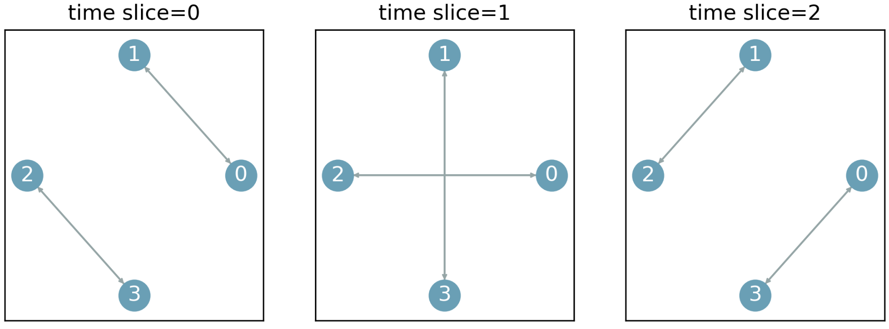

Topology Primitive
========================================================================

This example demonstrates how to construct a time-sliced topology using :py:meth:`openoptics.Toolbox.BaseNetwork.connect`.
We build a network consisting of 4 nodes, with each node connected to an optical switch via one upper link.
Across all time slices, each node establishes a connection with every other node exactly once.

.. literalinclude:: ../../../examples/topo_connect.py
   :language: python
   :linenos:
   :caption: examples/topo_connect.py

