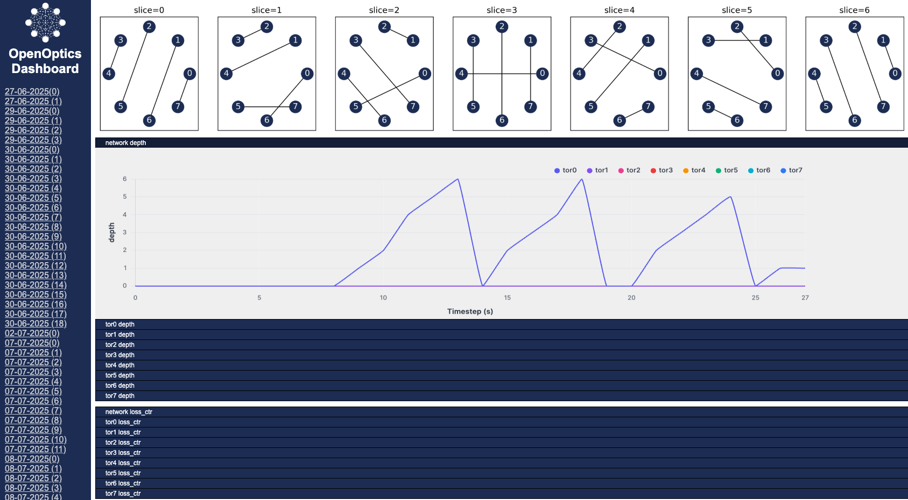

Quick Start
====================

Connect to Your Remote Machine
--------------------------------------

If you're using a remote machine, set up port forwarding for viewing the OpenOptics dashboard.

.. code-block:: bash

   ssh -L8001:0.0.0.0:8001 YOUR_MACHINE

The easiest way to get started is to use OpenOptics Docker image.

.. code-block:: bash

   docker pull ymlei/openoptics:latest

Then clone and enter the repository folder.

Enter the Container
-------------------

With VSCode devcontainer
^^^^^^^^^^^^^^^^^^^^^^^^

Open openoptics folder with VSCode remote.
With Docker and the VS Code Dev Containers extension installed, simply press Ctrl+Shift+P or Command+Shift+P (Mac) in your VS Code and run the "Dev Containers: Reopen in Container" command to open the repository inside the container. After that, Optics-Mininet is ready to go.

Or with bash
^^^^^^^^^^^^

.. code-block:: bash

   cd /openoptics
   docker run --privileged -dit --network host \
     --name openoptics \
     -v "$PWD:/openoptics" \
     openoptics /bin/bash
   docker exec -it openoptics bash

Initialize the Dashboard
------------------------

.. code-block:: bash

   cd /openoptics/openoptics/dashboard
   bash init.sh

With Example Scripts
--------------------

Use the following commands to start a round-robin optical DCN with direct path routing:

.. code-block:: bash

   cd examples
   python3 routing_direct_perhop.py

Then you can try ping in your optical DCN,

.. code-block:: bash

   h0 ping h1
   h2 ping h3

Defining Your Own Optical DCN with Python APIs
----------------------------------------------

.. image:: assets/openoptics-diagram.png
   :alt: OpenOptics Diagram

OpenOptics User APIs are located in ``openoptics/Toolbox.py``.
This file defines a number of useful functions for creating optical topologies, delopying routings, and monitoring the network.
Every OpenOptics network is a ``BaseNetwork`` object:

.. code-block:: python

   net = Toolbox.BaseNetwork(
       name="my_network",
       backend="Mininet",
       nb_node = 4,
       time_slice_duration_ms = 32, # in ms
       use_webserver=True)

You can use ``connect(node1,port1,node2,port2,time_slice)`` to connect ports of two nodes at the given time slice.

.. code-block:: python

   net.connect(node1=0,port1=0,node2=1,port2=0,time_slice=0)
   net.connect(node1=2,port1=0,node2=3,port2=0,time_slice=0)
   net.connect(node1=0,port1=0,node2=2,port2=0,time_slice=1)
   net.connect(node1=1,port1=0,node2=3,port2=0,time_slice=1)
   net.deploy_topo()

Or you can use provided high-level topology generators:

.. code-block:: python

   circuits = OpticalTopo.round_robin(nb_node=8)
   net.deploy_topo(circuits)

or

.. code-block:: python

   circuits = OpticalTopo.opera(nb_node = 8, nb_link=2)
   net.deploy_topo(circuits)

Next, you can define routing by adding time-flow table entries (as forwarding tables in eletrical DCNs) ``add_time_flow_entry(node_id, entries, routing_mode)``.
Or use provided high-level routing generators:

.. code-block:: python

   paths = OpticalRouting.routing_direct(net.slice_to_topo)
   net.deploy_routing(paths, routing_mode="Per-hop")

Once you have created a ``BaseNetwork`` object, and defined its topology and routing, start the network by simply calling ``net.start()``.
Now run your Python file and your first optical DCN is deployed!

``net.start()`` launches a command line interface defined in ``src/OpticalCLI.py``.
This CLI is an extension of Mininet's CLI, with added support for optical DCNs, e.g. to query the number of queued packets in switches and the network's packet loss rate. 

You could find example scripts configuring different architectures under ``openoptics/examples/``

Monitor with OpenOptics Dashboard
---------------------------------

To configure the OpenOptics web dashboard, navigate to ``src/dashboard`` and run:

.. code-block:: bash

   bash init.sh

Make sure to set ``use_webserver`` to true when creating your ``BaseNetwork`` object. 
In your web browser, visit http://0.0.0.0:8001 to view the dashboard.
The dashboard displays the network topology, along with realtime graphs of network performance served via WebSockets. 

Note: If you're running OpenOptics at a remote machine, make sure to enable port forwarding by passing ``-L8001:0.0.0.0:8001`` to ssh.