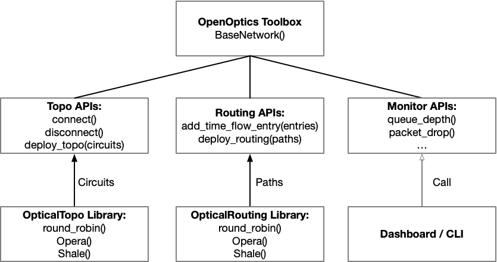

Quick Start
====================

This guide walks through running the Mininet backend end-to-end in a Docker
container. For the Tofino backend, see :doc:`tofino-backend`. For other
install paths (plain ``pip install`` without Docker), see :doc:`installation`.

Requirements
--------------
- Linux host with Docker installed
- (Optional) SSH access if running on a remote machine, for the dashboard port-forward

Step 1. Connect to your remote machine (if applicable)
------------------------------------------------------

If you're running OpenOptics on a remote machine, forward the dashboard port
so you can view it locally:

.. code-block:: bash

   ssh -L localhost:8001:localhost:8001 YOUR_MACHINE

Step 2. Pull the Docker image and enter the container
-----------------------------------------------------

The ``ymlei/openoptics:latest`` image has BMv2, Mininet, Thrift, and the P4
toolchain preinstalled — everything the Mininet backend needs at runtime.

.. code-block:: bash

   sudo docker pull ymlei/openoptics:latest
   sudo docker run --privileged -dit --network host \
        --name openoptics ymlei/openoptics:latest /bin/bash
   sudo docker exec -it openoptics bash

VS Code's Dev Containers extension also works: clone this repo, then press
**Ctrl+Shift+P** → **Dev Containers: Reopen in Container**.

Step 3. Install OpenOptics
--------------------------

Inside the container (which drops you in ``/root``):

.. code-block:: bash

   pip install "openoptics-dcn[mininet]"

This pulls the Python package plus the Mininet-Python bindings, Thrift,
FastAPI, and Uvicorn (for the in-process dashboard).

Step 4. Seed a working directory
--------------------------------

The installed package ships several helper CLIs that copy bundled content
into your current directory:

.. code-block:: bash

   openoptics-gen-examples          # writes ./examples/
   openoptics-gen-tutorials         # writes ./tutorials/  (optional)

Step 5. Run an example
----------------------

.. code-block:: bash

   python3 examples/mininet_routing_direct_perhop.py

You should see OpenOptics set up Mininet, bring up the BMv2 optical switch
and four ToR switches, deploy the topology and routing, and drop you into the
OpenOptics CLI. From there:

.. code-block:: bash

   OpenOptics> h0 ping h1
   OpenOptics> h2 ping h3

Press ``Ctrl-D`` to exit; the network tears itself down.

Defining your own optical DCN with the Python API
-------------------------------------------------

OpenOptics user APIs live in :mod:`openoptics.Toolbox`.
This module defines the primitives for creating optical topologies, deploying
routing, and monitoring the network. Every OpenOptics network is a
``BaseNetwork`` object:

.. code-block:: python

   from openoptics import Toolbox, OpticalTopo, OpticalRouting

   net = Toolbox.BaseNetwork(
       name="my_network",
       backend="Mininet",
       nb_node=4,
       time_slice_duration_ms=32,   # in ms
       use_webserver=True,
   )

The ``backend`` parameter selects the target. Backend-specific options are
passed as extra keyword arguments and validated at construction time. For
Mininet, ``link_delay_ms`` sets per-link propagation delay (default: 0):

.. code-block:: python

   net = Toolbox.BaseNetwork(
       name="my_network",
       backend="Mininet",
       nb_node=4,
       time_slice_duration_ms=32,
       link_delay_ms=1,             # 1 ms propagation delay (Mininet-specific)
       use_webserver=True,
   )

Use ``connect(node1, port1, node2, port2, time_slice)`` to wire ports
explicitly:

.. code-block:: python

   net.connect(node1=0, port1=0, node2=1, port2=0, time_slice=0)
   net.connect(node1=2, port1=0, node2=3, port2=0, time_slice=0)
   net.connect(node1=0, port1=0, node2=2, port2=0, time_slice=1)
   net.connect(node1=1, port1=0, node2=3, port2=0, time_slice=1)
   net.deploy_topo()

Or use the high-level topology generators:

.. code-block:: python

   circuits = OpticalTopo.round_robin(nb_node=8)
   net.deploy_topo(circuits)

.. code-block:: python

   circuits = OpticalTopo.opera(nb_node=8, nb_link=2)
   net.deploy_topo(circuits)

Define routing with ``add_time_flow_entry(node_id, entries, routing_mode)``
or use the high-level routing generators:

.. code-block:: python

   paths = OpticalRouting.routing_direct(net.get_topo())
   net.deploy_routing(paths, routing_mode="Per-hop")

Once you have defined topology and routing, start the network with
``net.start()``. This launches the OpenOptics CLI (an extension of Mininet's
CLI) with commands for querying queue depths, loss rates, and more.

You can find more example scripts in ``./examples/`` after running
``openoptics-gen-examples``, or browse them in the repository at `examples/
<https://github.com/mpi-ncs/openoptics/tree/release/examples>`_.

Monitor with the OpenOptics Dashboard
-------------------------------------

.. image:: ../assets/dashboard.png
   :alt: OpenOptics Dashboard

The dashboard starts automatically when you create a ``BaseNetwork`` with
``use_webserver=True`` (the default): FastAPI + Uvicorn serve the UI
in-process on ``localhost:8001``. Historical runs land in
``~/.openoptics/dashboard.sqlite3`` and show up in the epoch selector on
the left. Visit http://localhost:8001 in your browser to view the live
topology and realtime performance graphs (served over WebSockets).

If you're on a remote machine, remember to tunnel the port:

.. code-block:: bash

   ssh -L localhost:8001:localhost:8001 YOUR_MACHINE
