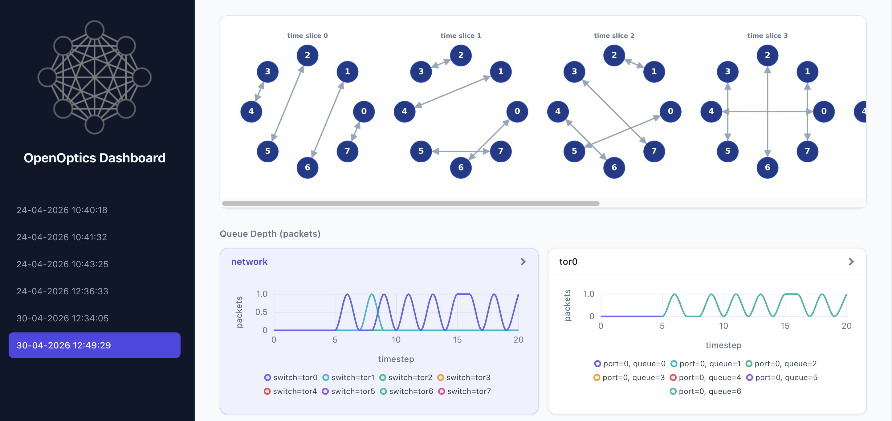

# Tutorial 1: Get Started

Welcome to OpenOptics Tutorial!
This first tutorial will help you get familiar with the basic workflow and dashboard.
You’ll run a Python script to deploy a simple optical data center network (DCN) in an emulation environment (Mininet).

If you are attending SIGCOMM’25 OpenOptics tutorial, you can log in to your assigned virtual machine (VM) using the commands below.
If not, please follow the installation instruction at [Quick Start](../quickstart) to set up your environment if you haven't.

```{admonition} Acknowledgments
Many thanks to [measurement.network](https://measurement.network/) for providing the VMs for this SIGCOMM'25 Tutorial, and to the team ([Tobias Fiebig](https://www.mpi-inf.mpg.de/departments/inet/people/tobias-fiebig)) for managing this wonderful project.
```

---

## Step 1: Log into Your VM

First, log into your VM. The `-L` flag forwards the port for the web dashboard, allowing you to access it from your local machine.

```bash
ssh -L localhost:8001:localhost:8001 USER_NAME@YOUR_HOST_NAME
```

If you are using VS Code with Remote Development, you can also use this command to connect your editor to the VM.

## Step 2: Enter the OpenOptics Environment

### Option A: With VS Code

1.	Make sure you have connected to the new remote with the above `ssh` command.
2.	With Dev Containers extension installed, press:
- Ctrl+Shift+P (Windows/Linux)
- Command+Shift+P (Mac)
3.	Run **Dev Containers: Attach to Running Container** and pick /openoptics.

```{note}
Do NOT select **Dev Containers: Reopen in Container**.
```

### Option B: With Terminal
Execute the following command after you log into your VM

```
sudo docker exec -it openoptics bash
```

You are all set! Let's get started!

### 1. Execute the OpenOptics Python Script.

```bash
cd /openoptics/tutorials
python3 1-get-started.py
```

The script (`tutorials/1-get-started.py`) contains:

```python
from openoptics import Toolbox, OpticalTopo, OpticalRouting
    
if __name__ == "__main__":

    nb_node = 8

    net = Toolbox.BaseNetwork(
        name="task1",
        backend="Mininet",
        nb_node = nb_node,
        nb_host_per_tor = 1,
        time_slice_duration_ms = 512, # in ms
        use_webserver=True)
    
    circuits = OpticalTopo.round_robin(nb_node=nb_node)
    assert net.deploy_topo(circuits)

    paths = OpticalRouting.routing_direct(net.get_topo())
    assert net.deploy_routing(paths)

    net.start()
```

This script creates an optical DCN with:

* An 8-node optical network. 
* A round-robin optical topology. 
* A direct routing between nodes. 
* A web server for monitoring at http://localhost:8001.


Under the hood, `BaseNetwork` creates a Mininet network with OCS, switches, and hosts (`h0`-`h7`).

Each ToR switch is connected to a port of optical circuit switch (OCS),
and each ToR switch is connected to a host, as we set `nb_host_per_tor = 1`.

### 2. View the dashboard.

After running the script, open your browser and navigate to http://localhost:8001.
You should see the network topology and real-time network metrics.



### 3. Test Network Connectivity

Use `ping` to test connectivity and delay between hosts:

For example:
```bash
# The first host is named with h0
OpenOptics-> h0 ping h1  # Equivalent to execute "ping h1" at h0
```

You should also see queue depth changes on the dashboard during the `ping` test.

### 4. Experiment with Time Slice Duration

Stop the script (Ctrl+D), then modify the `time_slice_duration_ms` parameter.

For example, change it from **512 -> 1024**
```python
...
time_slice_duration_ms = 1024
...
```

Then rerun the script and observe the change in `ping` delay at CLI and queue depth on the dashboard.
With a longer slice duration, you should see both **delay** and **queue depth** increase.