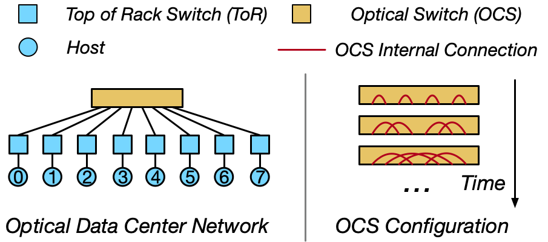

# Tutorial 2: Connect Nodes with Time-Sliced Topologies

In optical DCNs, topologies are determined by the internal connections of optical circuit switches (OCS).

As in the following figure:



With OpenOptics, you can define a **topology schedule** that specifies how electrical nodes (e.g., ToRs in the figure) connect to each other over time.
The primitive API is:

```python
connect(time_slice, node1, node2)
```

This primitive API lets you add an entry to the topology schedule to connect node1 and node2 in the given time slice.

## Your Tasks

You will:
1. Use the {doc}`connect()<../apis/generated/openoptics.Toolbox.BaseNetwork.connect>` API to create a **4-node** topology schedule,
2. Ensure the following:
   - In each time slice, each node connects to exactly one other node (i.e. each node has one link)
   - Across all time slices, every node connects to every other node **exactly once**.

This schedule guarantees that, over a period of time, each node can directly communicate with all other nodes.

You will implement your solution in `openoptics/tutorial/2-connect.py`.
Run the script to generate and visualize your topology schedule on the dashboard:

```python
python3 2-connect.py
```