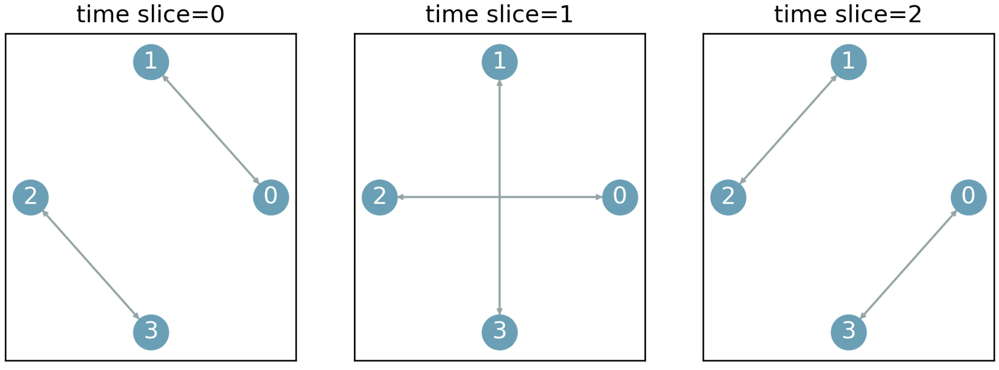

# Tutorial 5: Multi-Hop Routing with Time Flow Tables

We always send packets from the source to the destination through the direct connection.
Now we wil try something different: multi-hop routing.

Consider an topology as in the following figure:



Suppose `h0` wants to send a packet to `h3` at time slice 0.
With direct routing you have implemented, the packet cannot be sent out until time slice 2 when there is a direct connection between `h0` and `h3`.

But with multi-hop routing, the packet can be sent to `h1` at time slice 0, and from `h1` to `h3` at time slice 1.


## Your Tasks

You will implement **multi-hop routing** in your optical DCN:

1. Add time flow table entries to enable routing between `h0` and `h1`.
2. In the `ping` test, no packet loss should occur.
3. Compare the ping RTT and compared it with direct routing. Is it expected? Why?

Run the script and test your solution in the CLI with `OpenOptics> h0 ping h1`:
```python
python3 5-multi-hop-routing.py
```