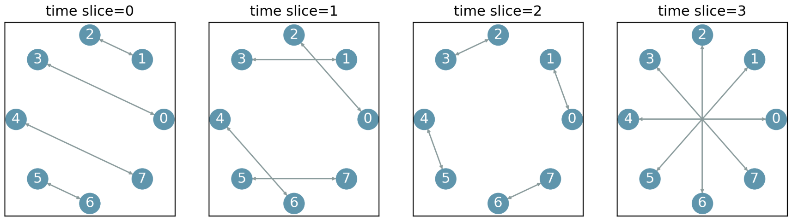

# Tutorial 8: Design Routing for an Application

In this tutorial, you are given a topology that does **NOT** provide direct connections between every pair of nodes.
Your goal is to design a **routing** on this topology for the same customized application introduced in Tutorial 7.



You can now use **Source Routing**, a scheme that allows the sender of a packet to explicitly specify the entire path it should take through the network.

## Defining Paths in OpenOptics

A path in OpenOptics can be defined as:
```
Path(src=0, arrival_ts=0, dst=5, steps=[Step(send_port=0, send_ts=3), Step(send_port=0, send_ts=2)])
```
This example defines a path from node 0 to node 5 for packets that arrive at time slice 0.
The packet takes two hops:
- At the source 0, it is forwarded out at time slice 3.
- At the next hop, it is forwarded out again at time slice 2.

OpenOptics also provides helper functions to generate paths based on the topology schedule.
For example, the default `my_routing` function in `tutorials/8-routing.py` generates direct paths for all node pairs with `find_direct_path()`
```
paths = OpticalRouting.find_direct_path(slice_to_topo, node1, node2)
```
Print out `paths` to check what paths are generated.

The path information is embedded in the packet header by the sender ToR, and the following ToRs enforce this path when forwarding the packet.

You can install a list of paths into the ToRs with `routing_mode` as **Source Routing**:
```python
net.deploy_routing(paths, routing_mode="Source")
```

## Application Setting (same as Tutorial 7)

        Group A (Hosts 0–3)                    Group B (Hosts 4–7)
        ┌───────────────┐                       ┌───────────────┐
        │ dense traffic │                       │ dense traffic │
        │ within group  │                       │ within group  │
        └───────────────┘                       └───────────────┘

            h0 --- h1                              h4 --- h5
             |  X  |                                |  X  |
            h2 --- h3                              h6 --- h7

                   \                                  /
                    \                                /
                     \______ light traffic _________/
                    between nodes in different groups

	•	The applications are divided into two groups.

	•	Group A = hosts 0–3; Group B = hosts 4–7.

	•	Groups have denser intra-group communication and lighter inter-group communication.

	•	Traffic ratio (intra-group : inter-group) = 2:1. (You don’t need to worry about this for this task.)

By default, the script `tutorials/8-routing.py` creates direct routing on all nodes.
This leads to packet loss, since not all node pairs have direct connections.

## Your Goal

Design a routing scheme for the given topology that:

1. Ensures no packet loss.
2. **Bonus**: How much is your `ping`'s max RTT between `h0` and `h5`? Could you reduce it more? Share your tail `RTT` (reported by `OpenOptics-> test_task8_bonus`) with your peers.


```{note}
For attendees of the SIGCOMM'25 Tutorial: You may notice some packet loss on the VMs. This is caused by limited computational resources. You will still pass tests with correct routing.
```


### Notice:

- Don't change the application.
- Don't change the topology.
- Don't change the slice duration.


To test your design in the OpenOptics CLI:

```bash
OpenOptics-> test_task8
```
Or only run the bonus test:
```bash
OpenOptics-> test_task8_bonus
```

You will see **PASS** if your solution meets all requirements.

You can also use `ping` between individual hosts to check connectivity and delay.